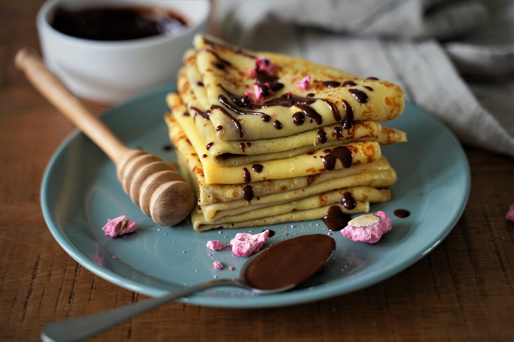

Add-ons : Choclate, Blue berries, strawberries, Chopped Bananas

# Ingredients

## Dry ingredients:

- 125g Plain Flour
- 3 Eggs
- 30g Peanut Butter
- Salt

## Wet ingredients:

- 300g Milk (boiled and cooled)
- 2 tablespoons of water

## Flavoring

- 2 teaspoons Vanilla
- 2 teaspoons Orange Blossom Water
- 2 teaspoons Zest (Lemon/Oranges)

# Preparation

1. Get a large enough bowl
2. pour in the milk and add the Flour gradually
3. add the whole eggs and mix well while adding the water spoons
4. add a pinch of salt and the peanut butter while always mixing
5.
6.

> Preparation **...** Chill **...**
