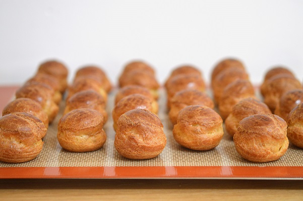

| Choux Pastry (Pâte à choux) | 
| --- |
| source: [Philippe Conticini](https://blog.beko.fr/pate-a-choux-conticini-recette/)| 
---

Choux pastry, is a delicate pastry dough used in many pastries. The pastry is used in many recipes mostly desserts but also some savoury preparations.

# Ingredients

* Ingredient 1
* Ingredient 2
* etc.

# Preparation

1. Simple steps
2. less is more
3. etc.

> Cooking **10 minutes** at **100-250 C°**

# Notes

Any personal annotations and advises go here
